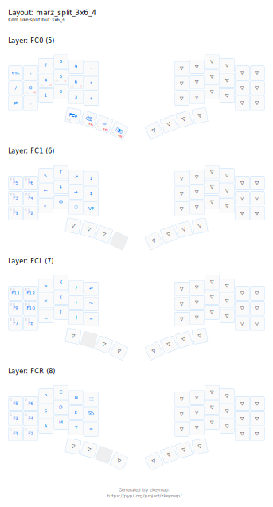

# Marz44W Split BLE Dongle Keyboard

Yet another Split Keyboard.


## Features

- Wireless Split
- USB Dongle
- ZKeymap based
- Up to 4 Bluetooth devices plus the main USB host

## Layout

```python
layer / "def" / label("DEF") / r"""
    {⌘ esc} [ q ] [ w ] [ f ] [ p ] [ b ]      [ j ] [ l ] [ u ] [ y ] [ acut ]    [ñ]
    {⎇ tab} {⇧ a} [ r ] [ s ] [ t ] [ g ]      [ m ] [ n ] [ e ] [ i ] {⇧ o}      <cw>
    {⎈  \ } [ z ] [ x ] [ c ] [ d ] [ v ]      [ k ] [ h ] [ , ] [ . ] [ ; ]     [ ⏎ ]
          (num tab) (sym ⌫) (nav ␣) [⇧ ⎇]      [r⎇] (nav ␣) (sym ⌫) (adj del)
    """

layer / "num" / label("NUM") / r"""
    _____   [ * ] [ 7 ] [ 8 ] [ 9 ] [ / ]      [ / ] [ 7 ] [ 8 ] [ 9 ] [ * ] [ ∴ ]
    [ , ]   [ 0 ] [ 4 ] [ 5 ] [ 6 ] [ - ]      [ - ] [ 4 ] [ 5 ] [ 6 ] [ 0 ] [ , ]
    [ zw ]  [ . ] [ 1 ] [ 2 ] [ 3 ] [ + ]      [ + ] [ 1 ] [ 2 ] [ 3 ] [ . ] _____
                  _____ _____ _____ _____      _____ _____ _____ _____
    """

layer / "sym" / label("SYM1") / r"""
    [ | ]    [ ! ] [ " ] [ # ] [ $ ] [ % ]      [ & ] [ / ] [ [ ] [ \] ] [ = ] [ ? ]
    [ grv ]  [ * ] [ ' ] [ : ] [ _ ] [ - ]      [ - ] [ ( ] [ ) ] [ {  ] [ } ] _____
    [ diae ] [ @ ] [ ~ ] [ ^ ] [ = ] [ + ]      [ + ] [ ' ] [ < ] [ >  ] [ \ ] _____
                   (adj) _____ _____ _____      _____ _____ (num~) _____
    """

layer / "nav" / label("NAV") / r"""
    _____ [ f1 ] [ f2 ] [ f3 ] [ f4 ] [ f5  ]     _____     [ pgup ] [  ↑  ] [ pgdn ] [  f10 ] [ f11 ]
    _____ [ ⇧  ] [ '  ] [ :  ] [ _  ] [ -   ]     [  home ] [   ←  ] [  ↓  ] [   →  ] [  end ] [ f12 ]
    _____ [ f6 ] [ f7 ] [ f8 ] [ f9 ] [ f10 ]     [ ⎈ home] [ ⎈ ←  ]  xxxxx  [ ⎈ →  ] [⎈ end ]  _____
                      _____ _____ _____ _____     _____ _____ _____ _____
    """

layer / "adj" / label("ADJ") / r"""
    <⚙>    _____     _____   _____ _____ _____      _____ _____ _____ _____ _____ <⚙>
    <ᛒclr> <ᛒ0>      <ᛒ1>    <ᛒ2>  <ᛒ3>  <ᛒ4>       <ᛒ4>  <ᛒ3>  <ᛒ2>  <ᛒ1>  <ᛒ0>  <ᛒclr>
    _____  [ nlck ]  <usb/ᛒ> _____ _____ _____      _____ _____ _____ _____ _____ _____
                     _____   _____ _____ _____      _____ _____ _____ _____
    """

```

## Layout graphics



## ZKeymap

To generate dtsi, keymap, json and svg files, install zkeymap and execute keymap.py

```bash
pip install zkeymap
cd config/boards/shields/marz44w
python keymap.py
```

Ref: [https://github.com/mnesarco/zkeymap](https://github.com/mnesarco/zkeymap)